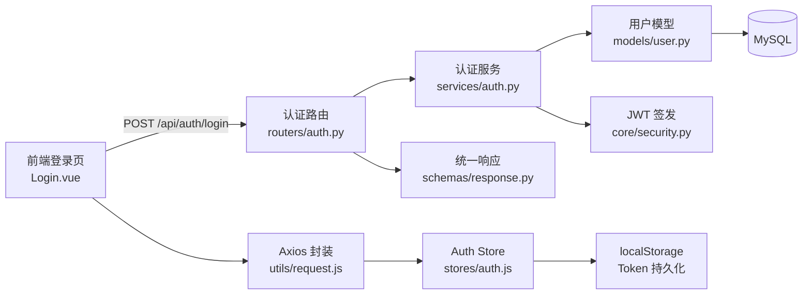
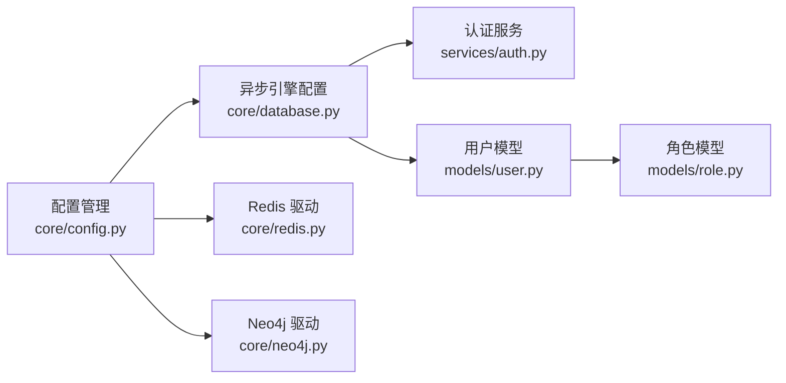
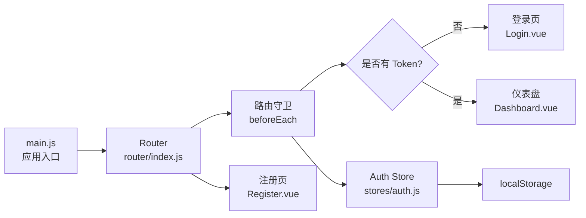

# 水库水质智能监测分析平台 — 模块说明文档

> 本文档说明系统已实现部分的业务功能设计、模块边界和协作关系。
> `doc/项目结构文档.md` 负责说明代码组织，本文档负责说明业务模块如何支撑产品能力。
> 更新日期：2026-05-25

---

## 1. 文档定位

本文档面向开发者和架构评审人员，从业务功能视角说明系统的模块划分与设计意图。与 `doc/` 下的开发设计文档不同，本文不列出接口地址或代码路径，而是回答"每个模块做什么、不做什么、和谁协作"。阅读本文前建议先阅读 `doc/水库水质智能监测分析平台_开发设计文档.md` 了解系统全貌。

**重要说明**：本文档仅覆盖当前已实现的代码文件。系统中包含大量已设计但尚未实现的功能（Agent 引擎、知识图谱、预警中心、RAG 问答等），相关内容来自开发设计文档中的规划，在本文中标注为"规划中"，不作为已交付能力描述。

---

## 2. 系统功能定位

### 2.1 一句话定位

以多水库水质监测数据为核心，汇聚自动站、人工采样、标准规范、处置经验和污染源关系，构建"数据接入 — 实时展示 — 异常识别 — 知识增强 — 图谱溯源 — Agent 分析 — 人工确认"一体化水质管理平台。

### 2.2 当前阶段能力

系统当前处于**第一阶段（基础架构与认证）**，已实现用户在平台上的身份注册、登录鉴权与退出，其余业务能力处于规划或初始化阶段。

| 能力方向 | 业务目标 | 实现状态 |
|----------|----------|---------|
| 身份认证与权限 | 用户可注册、登录、退出，接口具备鉴权能力 | ✅ 已实现 |
| 多源数据接入 | 自动站/人工采样数据统一入库与校验 | 📋 规划中 |
| 实时监测看板 | 水库水质态势可视化与实时推送 | 📋 规划中 |
| 智能预警中心 | 规则/AI 混合预警与处置闭环 | 📋 规划中 |
| 知识增强问答 | 标准/案例检索增强的智能问答 | 📋 规划中 |
| 水质知识图谱 | 污染溯源与指标关联分析 | 📋 规划中 |
| Agent 智能分析 | 多 Agent 协作工作流编排 | 📋 规划中 |
| 报告与调度 | 巡检报告生成与多库调度建议 | 📋 规划中 |

---

## 3. 端侧职责划分

| 端侧 | 职责定位 | 设计关注点 |
|------|----------|-----------|
| 前端界面（Vue 3 SPA） | 用户交互入口，提供认证页面和基础框架 | 组件化架构、路由守卫、状态持久化、API 封装 |
| 后端 API 服务（FastAPI） | 业务逻辑核心，提供 REST API、数据持久化和鉴权 | 分层架构（API → Service → Model）、统一响应、异常处理 |
| MySQL 数据库 | 结构化业务数据存储（用户、角色） | 异步连接池、ORM 建模、自动建表 |
| Redis 缓存 | （已初始化，未接入业务） | 异步客户端驱动、连接管理 |
| Neo4j 图数据库 | （已初始化，未接入业务） | 异步驱动、连接生命周期 |
| 外部 AI 服务 | （API Key/URL 已配置，未接入业务） | 双模型路由（DeepSeek-V4 / Qwen-Max）配置就绪 |

---

## 4. 功能模块总览

| 模块 | 定位 | 核心产出 | 状态 |
|------|------|---------|------|
| 认证与用户管理 | 用户身份识别、注册登录与接口鉴权 | 注册/登录 API、JWT Token、前端登录/注册页 | ✅ 可运行 |
| 后端支撑基础设施 | 配置管理、数据库连接、鉴权工具、异常体系 | 配置对象、DB 会话、JWT 工具、统一响应函数 | ✅ 可运行 |
| 前端应用框架 | 应用初始化、路由守卫、状态管理、HTTP 封装 | Vue 应用入口、路由表、Pinia Store、Axios 实例 | ✅ 可运行 |
| 看板占位 | 登录后的默认落地页面 | 带退出功能的占位页面 | ⚪ 占位符 |

---

## 5. 各业务模块说明

### 5.1 认证与用户管理

**定位**：系统身份入口，管理用户注册、登录、退出及访问鉴权，是唯一完整实现前后端全链路的业务模块。

**核心功能**：
- 用户注册 — 用户名唯一性检查、bcrypt 密码哈希、持久化用户信息到 MySQL
- 用户登录 — 凭用户名+密码校验、更新最后登录时间、签发 JWT Token
- 用户退出 — 前端清除 Token，后端提供退出接口
- 路由守卫 — 未登录用户自动跳转登录页，已登录用户跳过登录页
- Token 自动注入 — Axios 拦截器为每个请求附加 Authorization 头
- 统一鉴权依赖注入 — FastAPI 依赖从 Token 解析当前用户身份

**设计边界**：
- 当前仅支持用户名+密码登录，不支持手机号/钉钉等第三方登录
- 密码重置需人工操作数据库，未提供前端自助重置入口
- JWT 有效期为 24 小时（由环境变量配置），当前未实现无感刷新
- 角色权限模型（Role/Permission）已定义但未接入实际业务接口校验
- Token 当前未实现黑名单/失效机制

**关联模块**：
- 后端支撑基础设施（配置/数据库/JWT 工具/异常处理）
- 前端应用框架（路由守卫/Pinia Store/Axios 拦截器）

**开发关注点**：
- 密码仅使用 bcrypt 哈希后存储，禁止明文记录
- JWT Secret 必须从环境变量读取，禁止硬编码
- 注册和登录的异常需要区分"用户名已存在""密码错误""账号禁用"等不同场景
- Token 解析失败时统一返回 401，避免泄露内部错误细节
- `require_role` 装饰器虽已实现，但在实际接口中使用前须确认角色编码数据已初始化

---

## 6. 通用支撑能力

### 6.1 配置管理与环境变量

**职责**：基于 `pydantic-settings` 从 `.env` 文件集中加载所有运行时配置，提供单例配置对象。

**使用原则**：所有模块通过 `get_settings()` 获取配置，不直接读取环境变量或 `.env` 文件。

**开发时应避免**：在业务代码中直接调用 `os.getenv` 或硬编码配置值。

### 6.2 数据库连接与会话管理

**职责**：管理 MySQL 异步引擎与连接池、Redis 异步客户端、Neo4j 驱动的生命周期；提供 FastAPI 依赖注入用的会话生成器和事务提交辅助函数。

**使用原则**：API 层通过 `get_db()` 依赖注入获取数据库会话，Service 层通过 `commit_or_rollback()` 统一管理事务。

**开发时应避免**：API 路由中直接使用 SQLAlchemy Session 执行查询；在 Service 层之外提交或回滚事务。

### 6.3 JWT 认证与鉴权

**职责**：提供 Token 签发、解码验证、当前用户解析和角色权限校验等依赖注入工具。

**使用原则**：所有业务接口（除登录/注册/健康检查）均应依赖 `get_current_user` 或 `require_role` 进行鉴权。

**开发时应避免**：在前端直接存储或传递敏感权限判断；依赖前端隐藏来控制后端访问。

### 6.4 统一响应与异常处理

**职责**：定义全局统一响应结构 `{code, message, data}`，提供 `success()`/`error()` 辅助函数；定义业务异常 `ServiceException` 和错误码枚举 `ErrorCode`。

**使用原则**：Service 层通过抛出 `ServiceException` 报告业务错误，API 层通过 `try-except` 捕获后转为统一错误响应。

**开发时应避免**：在 Service 层直接返回 HTTP 状态码或响应字典；使用魔法数字作为错误码。

### 6.5 日志配置

**职责**：提供带时间、文件名、行号的格式化日志配置器。

**使用原则**：每个模块调用 `setup_logger` 获取独立 Logger 实例，按模块名区分日志来源。

**开发时应避免**：使用 `print()` 输出调试信息；在生产级别使用 `DEBUG` 级别持久化日志。

### 6.6 前端应用框架

**职责**：Vue 3 应用初始化、Element Plus 组件库与图标注册、Vite 构建与 API 代理配置。

**使用原则**：所有页面组件遵循 Composition API + `<script setup>` 模式，样式优先使用 Tailwind 原子类。

**开发时应避免**：未经封装的 Axios 直接调用后端接口；绕过路由守卫直接访问页面组件。

### 6.7 前端 HTTP 请求封装

**职责**：基于 Axios 的统一请求实例，自动附加 JWT Token、统一响应拦截处理（code 校验、错误分类）。

**使用原则**：所有 API 请求通过 `utils/request.js` 导出的实例发起，响应拦截器中统一处理 401 跳转登录和错误提示。

**开发时应避免**：在业务组件中重复书写 Token 附加逻辑；在拦截器中吞掉错误后不反馈给业务层。

### 6.8 前端状态管理

**职责**：基于 Pinia 管理登录状态、Token 持久化、用户信息缓存。

**使用原则**：涉及跨页面的用户身份和权限状态统一由 Pinia Store 管理，组件内通过 `useAuthStore()` 获取。

**开发时应避免**：在多个组件中分别从 `localStorage` 读取 Token；在 Store 以外修改 Token 持久化逻辑。

---

## 7. 模块间关键关系

### 7.1 认证全链路关系

图释：用户在登录页提交凭据，经由后端认证路由 → 服务层 → 数据模型完成密码校验后签发 JWT，最终 Token 通过统一响应返回前端，由 Axios 拦截器自动注入到后续请求的 Authorization 头。

### 7.2 数据库依赖关系

图释：所有数据库驱动的连接参数统一从配置管理读取；MySQL 数据库连接唯一被业务代码（认证服务）使用，Redis 和 Neo4j 驱动已初始化但尚无业务调用。

### 7.3 前端路由与鉴权

图释：路由守卫根据 Pinia Store 中的 Token 状态决定页面跳转逻辑，未登录用户无法访问需要认证的路由（/dashboard），已登录用户访问登录页时自动跳转仪表盘。

---

## 8. 典型业务闭环

### 8.1 用户注册 → 登录 → 鉴权访问 → 退出（已实现）

1. 用户在注册页（`/register`）填写用户名、密码、确认密码，前端校验密码一致性及手机号格式
2. 前端调用 `POST /api/auth/register`，服务层检查用户名唯一性，bcrypt 哈希密码后写入 MySQL `user` 表
3. 注册成功提示后 3 秒自动跳转登录页（`/login`）
4. 用户在登录页输入用户名和密码，调用 `POST /api/auth/login`
5. 服务层按用户名查询活跃用户（status=1），bcrypt 校验密码，更新 `last_login` 时间，签发 JWT（含 `user_id`、`username`、`role_id`，有效期 24 小时）
6. 前端将 Token 存入 Pinia Store 和 `localStorage`，跳转到仪表盘（`/dashboard`）
7. 后续所有 API 请求经由 Axios 拦截器自动附加 `Authorization: Bearer <token>` 头
8. 用户点击退出按钮，前端清除 Token 和用户信息，路由守卫将页面重定向回登录页

---

## 9. 后续开发参考原则

以下原则基于开发设计文档中的规划提炼，供后续模块开发时参考：

1. **分层依赖不可逆**：API 层可调用 Service 层，Service 层可调用 Models 层，禁止反向调用或跨层依赖
2. **统一响应是契约**：所有接口使用 `{code, message, data}` 结构，成功用 `success()`、错误用 `error()` 构造，前端以 `code === 0` 判定成功
3. **异常抛给上层处理**：业务异常在 Service 层抛出 `ServiceException`，API 层捕获后转为统一错误响应，不在 Service 层自行处理 HTTP 响应
4. **JWT 鉴权是底线**：所有业务接口（除登录/注册/健康检查）必须附加 `get_current_user` 依赖，RBAC 权限在后端二次校验，不依赖前端隐藏
5. **密码与密钥不上前端**：密钥级的敏感信息（JWT Secret、AI API Key、数据库密码）仅存在于后端环境变量
6. **业务功能新增时先确认主数据是否存在**：水库、监测站、监测指标等主数据是下游业务（看板、预警、RAG、图谱）的前提
7. **异步任务要有可追踪状态**：巡检、报告生成等耗时操作返回 `task_id`，通过轮询或 WebSocket 推送状态，不阻塞 HTTP 响应
8. **AI 生成必须有据可查**：RAG 答案必须返回来源（文档标题、片段位置），禁止无依据生成结论；Agent 关键处置节点保留人工确认入口
9. **预警状态机由后端控制**：预警的 `new → confirmed → processing → resolved` 流转由后端服务层控制，前端只调用状态变更接口，不直接改写状态字段
10. **新增模块遵循先定义 Schema 再写 Service 再写 API 的顺序**：数据结构约定在前，业务逻辑在中，路由入口在后，保持自底向上的依赖方向
