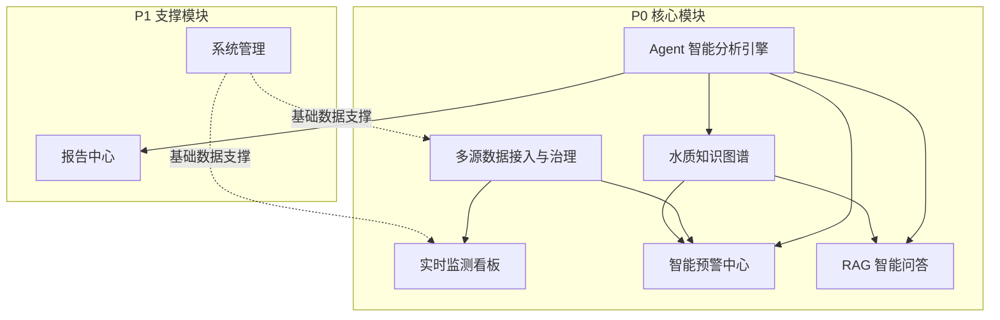

# 水库水质智慧监测平台 · 前端驱动功能模块与接口设计

## 1. 模块总览

### 1.1 系统模块架构

平台由 8 个业务模块构成，按优先级分为 P0 核心模块和 P1 支撑模块。各模块职责清晰、依赖明确：

| 模块 | 优先级 | 职责定位 | 技术依赖 |
|------|--------|---------|---------|
| M1 多源数据接入与治理 | P0 | 数据底座：监测记录存储、查询、校验 | MySQL、Redis |
| M2 实时监测看板 | P0 | 数据展示层：首页总览、水库卡片 | 依赖 M1 |
| M3 智能预警中心 | P0 | 预警生命周期：检测→确认→处置→归档 | 依赖 M1、M5、M6 |
| M4 RAG 智能问答 | P0 | 知识问答：标准/案例/预案的自然语言检索 | Chroma、LLM |
| M5 水质知识图谱 | P0 | 关系推理：溯源、指标关联、管网拓扑 | Neo4j |
| M6 Agent 智能分析引擎 | P0 | 系统大脑：编排巡检/预警/应急/报告/调度工作流 | LangGraph、LLM |
| M7 报告中心 | P1 | 报告生产：巡检/季度/事件报告生成与审核 | 依赖 M6 |
| M8 系统管理 | P1 | 基础配置：用户/角色/权限/水库/站点/指标 | MySQL |

### 1.2 前端页面与模块映射

| 编号 | 页面 | 目标用户 | 对应模块 | 接口覆盖 |
|------|------|---------|---------|---------|
| 07a | 登录页 | 全部用户 | M8 | 已覆盖 |
| 07b | 首页告警总览 | 全部用户 | M2、M3 | 已覆盖 |
| 07c | 水库实时监测详情 | 监测员、技术员 | M1、M2 | 已覆盖 |
| 07d | 预警中心 | 监测员、技术员、负责人 | M3 | 已覆盖 |
| 07e | 预警详情与溯源 | 技术员、分析师、负责人 | M3、M5、M6 | 部分覆盖 |
| 07f | 智能问答 | 全部用户 | M4 | ✅ 已实现（SSE 流式 + 对话历史管理 + 重试/修改） |
| 07g | 知识图谱可视化 | 分析师、负责人 | M5 | ✅ 已实现（力导向图谱 + 节点搜索 + 水库筛选 + 节点详情 + 节点展开 + 污染溯源 + 聚焦模式） |
| 07h | 巡检报告列表与详情 | 全部用户 | M7 | ❌ 待补 |
| 07i | 水库站点配置管理 | 管理员 | M8 | 已覆盖 |
| 07j | 知识库管理 | 管理员、负责人 | M4、M8 | 部分覆盖（上传+列表+详情+删除+重新处理） |
| 07k | 用户与权限管理 | 管理员 | M8 | 已覆盖 |
| 07l | 水源调度建议 | 管理层、负责人 | M5、M6 | 待补 |
| 07m | 预警规则管理 | 管理员 | M8 | 已覆盖 |

---

## 2. 系统管理模块（M8）

### 功能描述

M8 提供平台基础能力支撑，是其他所有模块的数据上游。包含用户认证与登录、用户与角色的权限管理、以及水库/监测站点/监测指标的基础数据配置。所有 CRUD 接口要求 admin 角色，认证接口无角色要求。

当前 M8 是接口覆盖最完整的模块，登陆、用户、角色、水库、站点、指标、预警规则七组接口均已实现。后续可补充导入导出、权限树模板等辅助能力。

### 涉及页面

- **登录页（07a）** —— 登录/注册/退出/当前用户
- **用户与权限管理（07k）** —— 用户 CRUD、角色 CRUD
- **水库站点配置管理（07i）** —— 水库/站点/指标 CRUD
- **预警规则管理（07m）** —— 规则 CRUD、启用/禁用

### 接口设计

#### 2.1 认证登录

| 功能 | 方法 | 路径 | 请求参数 | 响应 | 状态 |
|------|------|------|---------|------|------|
| 登录 | POST | /api/auth/login | username, password, phone?(11位), dingtalk_id? | access_token + username | ✅ |
| 注册 | POST | /api/auth/register | username, password, phone?(11位) | user_id + username | ✅ |
| 退出登录 | POST | /api/auth/logout | — | message | ✅ |
| 当前用户 | GET | /api/auth/me | — | user_id, username, role, phone?, dingtalk_id? | ✅ |

#### 2.2 用户管理

| 功能 | 方法 | 路径 | 请求参数 | 响应 | 状态 |
|------|------|------|---------|------|------|
| 用户列表 | GET | /api/users/list | keyword?, role_id?, status?, page, page_size | 分页用户列表 | ✅ |
| 添加用户 | POST | /api/users/add | username, password?(默认"123456"), real_name?, phone?, role_id, dingtalk_id? | id + username | ✅ |
| 用户详情 | GET | /api/users/{id} | — | 用户全部字段 | ✅ |
| 更新用户 | PUT | /api/users/{id} | real_name?, phone?, role_id?, dingtalk_id?, status? | 更新后用户信息 | ✅ |
| 重置密码 | POST | /api/users/{id}/reset-password | password | true | ✅ |

#### 2.3 角色管理

| 功能 | 方法 | 路径 | 请求参数 | 响应 | 状态 |
|------|------|------|---------|------|------|
| 角色列表 | GET | /api/roles/list | page?, page_size? | 分页角色列表 | ✅ |
| 添加角色 | POST | /api/roles/add | name, code, permissions? | 角色详情含 permissions | ✅ |
| 角色详情 | GET | /api/roles/{id} | — | 角色全部字段含 permissions | ✅ |
| 更新角色 | PUT | /api/roles/update | id, name?, code?, permissions? | true | ✅ |
| 删除角色 | DELETE | /api/roles/{id} | — | true | ✅ |

#### 2.4 水库管理

| 功能 | 方法 | 路径 | 请求参数 | 响应 | 状态 |
|------|------|------|---------|------|------|
| 水库列表 | GET | /api/reservoir/list | keyword?, watershed?, water_grade?, status?, page, page_size | 分页水库列表 | ✅ |
| 创建水库 | POST | /api/reservoir/create | name, code, location?, longitude?, latitude?, capacity?, water_grade?, watershed?, sort_order?(默认0) | true | ✅ |
| 水库详情 | GET | /api/reservoir/{id} | — | 水库全部字段含 status | ✅ |
| 更新水库 | PUT | /api/reservoir/{id} | name?, code?, location?, longitude?, latitude?, capacity?, water_grade?, watershed?, status?, sort_order? | true | ✅ |
| 删除水库 | DELETE | /api/reservoir/{id} | — | true | ✅ |

#### 2.5 监测站点管理

| 功能 | 方法 | 路径 | 请求参数 | 响应 | 状态 |
|------|------|------|---------|------|------|
| 创建站点 | POST | /api/stations/create | reservoir_id, name, code, type?(auto/manual/sensing), longitude?, latitude?, sampling_point? | true | ✅ |
| 站点列表 | GET | /api/stations/list | reservoir_id?, keyword?, code?, type?, page, page_size | 分页站点列表含 last_data_time | ✅ |
| 站点详情 | GET | /api/stations/{id} | — | 站点全部字段含 status | ✅ |
| 更新站点 | PUT | /api/stations/{id} | reservoir_id?, name?, code?, type?, longitude?, latitude?, sampling_point?, status? | true | ✅ |
| 删除站点 | DELETE | /api/stations/{id} | — | true | ✅ |

#### 2.6 指标管理

| 功能 | 方法 | 路径 | 请求参数 | 响应 | 状态 |
|------|------|------|---------|------|------|
| 创建指标 | POST | /api/indicators/create | name, code, unit?, category?(物理/化学/生物/综合), standard_limit_i~v_lower?, standard_limit_i~v_upper?, is_core?(0/1) | true | ✅ |
| 指标列表 | POST | /api/indicators/list | name?, code?, category?, is_core?, page, page_size | 分页指标列表含标准限值 | ✅ |
| 指标详情 | GET | /api/indicators/{id} | — | 指标全部字段 | ✅ |
| 更新指标 | PUT | /api/indicators/{id} | name?, code?, unit?, category?, standard_limit_i~v_lower?, standard_limit_i~v_upper?, is_core? | true | ✅ |
| 删除指标 | DELETE | /api/indicators/{id} | — | true | ✅ |

---

#### 2.7 预警规则管理

| 功能 | 方法 | 路径 | 请求参数 | 响应 | 状态 |
|------|------|------|---------|------|------|
| 规则列表 | POST | /api/v1/alert-rules/list | indicator_id?, reservoir_id?, is_active?, page, page_size | 分页规则列表(含 rule_name, indicator_id, compare_direction, trigger_class, alert_level, is_active, remark) | ✅ |
| 规则详情 | GET | /api/v1/alert-rules/{id} | — | 规则全部字段含 remark/created_at/updated_at | ✅ |
| 创建规则 | POST | /api/v1/alert-rules/create | rule_name, indicator_id, reservoir_id?, compare_direction(gt/lt), trigger_class(I~V), alert_level(1~3), is_active?, remark? | true | ✅ |
| 更新规则 | PUT | /api/v1/alert-rules/{id} | rule_name?, indicator_id?, reservoir_id?, compare_direction?, trigger_class?, alert_level?, is_active?, remark? | true | ✅ |
| 删除规则 | DELETE | /api/v1/alert-rules/{id} | — | true | ✅ |

## 3. 多源数据接入与治理模块（M1）

### 功能描述

M1 是系统的数据底座，负责各类水质监测数据的接入、清洗校验与关系型存储。核心数据实体为监测记录（monitoring_record），关联水库、站点、指标三个维度。

当前 M1 已实现监测记录的**查询**能力——支持按水库/站点/指标/时间范围/数据质量多维度筛选的分页列表、全指标最新值聚合查询、以及单指标时序趋势查询。数据**写入**层面，监测记录由外部自动化采集程序或定时任务入库，当前未提供人工录入 REST 接口，后续可补充人工采样录入和 Excel 批量导入接口。

本次新增 **Redis 24h 缓存**：定时采集入库后同步写入 Redis（ZSET 趋势数据 + String 最新值），24h 内趋势查询和最新值查询优先走 Redis，响应速度提升 10~50 倍。Redis 不可用时自动降级 MySQL，对前端透明。

### 涉及页面

- **水库实时监测详情（07c）** —— 实时数据 Tab 使用水库全指标最新值接口，历史趋势 Tab 使用趋势查询接口，监测站点 Tab 使用站点列表接口

### 接口设计

| 功能 | 方法 | 路径 | 请求参数 | 响应 | 状态 |
|------|------|------|---------|------|------|
| 监测记录列表 | GET | /api/monitoring/records | page, page_size, reservoir_id?, station_id?, indicator_id?, start_time?, end_time?, quality_flag?(0/1/2) | 分页记录列表(含 id, reservoir_id, station_id, indicator_id, value, record_time) | ✅ |
| 水库全指标最新值 | GET | /api/monitoring/last | reservoir_id | records | ✅ |
| 监测趋势 | GET | /api/monitoring/trend | reservoir_id, indicator_id, start_time?, end_time? | lists + total | ✅ |
| 人工采样录入 | POST | /api/monitoring/manual-input | station_id, indicator_id, value, record_time, quality_flag?(0/1/2) | 创建的监测记录(含 id, reservoir_id, station_id, indicator_id, value, record_time) | ✅ |
| Excel 批量导入 | POST | — | file(CSV/Excel), reservoir_id | — | ❌ 待补 |

---

## 4. 实时监测看板模块（M2）

### 功能描述

M2 是系统的数据展示层，直接面向监测员和管理层提供"第一眼"全局水质概览。包含四个统计卡片、水库卡片网格列表以及各水库核心指标最新监测值。数据源自 M1 的聚合查询，当前通过独立的仪表盘接口提供封装好的统计和卡片数据。

M2 当前已实现首页总览统计、水库卡片列表和最近告警三个核心接口，数据格式与前端页面需求基本匹配，但部分字段语义存在微调空间（如 `normal_count` 实际为在线站点数而非正常水库数，`alert_count` 为全部告警总数而非今日告警数）。

### 涉及页面

- **首页告警总览（07b）** —— 统计卡片使用 overview 接口，水库卡片网格使用 reservoir-cards 接口，最新告警时间线使用 last-alert 接口

### 接口设计

| 功能 | 方法 | 路径 | 请求参数 | 响应 | 状态 |
|------|------|------|---------|------|------|
| 仪表盘总览 | GET | /api/v1/dashboard/overview | — | reservoir_count, normal_count, abnormal_count, alert_count, offline_stations | ✅ |
| 水库卡片列表 | GET | /api/v1/dashboard/reservoir-cards | — | 水库数组(各含 id, name, code, location?, water_grade?, watershed?, station_count, online_station_count, alert_count, indicators[]) | ✅ |
| 最近告警 | GET | /api/v1/dashboard/last-alert | — | 最近 5 条告警数组，含 alert_id, reservoir_id, title, alert_level, indicators, status, detected_at | ✅ |

---

## 5. 智能预警中心模块（M3）

### 功能描述

M3 负责预警事件从发现到闭环的完整生命周期管理。当前已实现预警的**基础查询与状态流转**——支持按水库/等级/状态/时间范围筛选的分页列表、单条详情查看、以及状态更新（确认→处置→解决，同时记录处理人）。

预警内容的深度分析能力（溯源推理、AI 处置建议步骤化、历史相似事件匹配）依赖 M5 图谱和 M6 Agent 提供数据，当前仅存储 `source_desc` 和 `suggestion` 字符串字段，尚未支持结构化的溯源图谱和步骤化建议。

本次新增 **自动预警检测**：定时采集数据入库后自动匹配 `alert_rule` 表规则，按比较方向+触发等级判定是否超标。同指标同水库已存在未关闭预警则跳过，不同指标合并为复合告警（取最高等级、更新标题为"多指标复合告警"）。默认预置 10 条全局规则覆盖 COD/氨氮/溶解氧/浊度/pH 五个核心指标。

本次新增 **WebSocket 实时预警推送**：自动预警创建后通过 `/ws/alerts` 实时推送到所有在线浏览器，前台以 `ElNotification` 弹窗展示，点击跳转预警详情。断线后 5 秒自动重连。

### 涉及页面

- **预警中心（07d）** —— 预警列表分页、多条件筛选
- **预警详情与溯源（07e）** —— 预警基础信息、超标指标、状态流转、溯源与建议（待补）

### 接口设计

| 功能 | 方法 | 路径 | 请求参数 | 响应 | 状态 |
|------|------|------|---------|------|------|
| 预警列表 | GET | /api/v1/alerts | page, page_size, reservoir_id?, alert_level?(1/2/3), status?(0~3), start_time?, end_time? | 分页预警列表(含 handler_name, title, alert_level(1/2/3), indicators, status, detected_at, resolved_at) | ✅ |
| 预警详情 | GET | /api/v1/alerts/{id} | — | 预警详情(含 id, reservoir_id, handler_id, title, alert_level, indicators, source_desc?, suggestion?, notes[], status, detected_at, resolved_at) | ✅ |
| 更新预警状态 | PUT | /api/v1/alerts/{id} | status(0~3), handler_id? | 更新后预警详情 | ✅ |
| 处置备注 | POST | /api/v1/alerts/{id}/notes | content | 备注详情(含 id, user_id, content, created_at) | ✅ |
| 未读预警数 | GET | /api/v1/alerts/unread-count | — | count | ✅ |
| 批量标记已读 | PUT | /api/v1/alerts/batch-read | ids, handler_id? | true | ✅ |
| 预警溯源 | GET | — | — | nodes + edges | ❌ 待补 |
| 历史相似事件 | GET | — | — | events[] | ❌ 待补 |
| 新预警实时推送 | WS | /ws/alerts | — | 预警事件 JSON（new_alert 新预警 / alert_updated 合并预警，含 type/id/title/alert_level/status） | ✅ |

---

## 6. RAG 智能问答模块（M4）

### 功能描述

M4 提供基于 RAG（检索增强生成）的智能问答能力，让用户通过自然语言直接查询水质标准、处置预案和历史案例。核心流程：知识库文档上传 → 文本切片 → Embedding 向量化 → Chroma 存储 → 用户提问 → 语义检索 → LLM 生成带出处回答。

当前 M4 已实现知识库文档上传、列表、详情、删除和重新处理接口，基于 PDF→RecursiveCharacterTextSplitter、Markdown→MarkdownHeaderTextSplitter 按文件类型分策略切片、DashScope Embedding 向量化、Chroma 持久化存储。智能问答对话接口（流式 SSE）已基于 Chroma 语义检索 + DeepSeek-V4 Flash 流式生成实现。

### 涉及页面

- **知识库管理（07j）** —— 文档上传、文档列表、文档详情、文档删除、文档重新处理 —— ✅ 已实现
- **智能问答（07f）** —— 对话式问答、流式输出、参考来源展示 —— ✅ 已实现

### 接口设计

#### 6.1 知识库文档管理（本阶段实现）

| 功能 | 方法 | 路径 | 请求参数 | 响应 | 状态 |
|------|------|------|---------|------|------|
| 上传文档 | POST | /api/v1/documents/upload | files(multipart), category(int) | UploadDocumentResponse(total, success_count, failed_count, lists[]) | ✅ 已实现 |
| 文档列表 | GET | /api/v1/documents | keyword?, doc_type?, status?, page, page_size | 分页文档列表(含 id, title, file_name, file_size, doc_type, status, chunk_count, created_at) | ✅ 已实现 |
| 文档详情 | GET | /api/v1/documents/{id} | — | 文档全部字段(含 id, title, file_name, file_size, doc_type, status, chunk_count, content, metadata, created_at, updated_at) | ✅ 已实现 |
| 删除文档 | DELETE | /api/v1/documents/{id} | — | true | ✅ 已实现 |
| 重新处理文档 | POST | /api/v1/documents/{id}/reprocess | — | true | ✅ 已实现 |

#### 6.2 智能问答对话（当前阶段实现）

| 功能 | 方法 | 路径 | 请求参数 | 响应 | 状态 |
|------|------|------|---------|------|------|
| 智能问答(流式) | POST | /api/v1/chat | query, session_id? | SSE 流式 chunk + done | ✅ 已实现 |
| 对话历史列表 | GET | /api/v1/chat | page, page_size | 分页对话列表 | ✅ 已实现 |
| 对话详情 | GET | /api/v1/chat/{id} | 路径参数 id | 对话详情含消息列表 | ✅ 已实现 |
| 删除对话 | DELETE | /api/v1/chat/{id} | 路径参数 id | true | ✅ 已实现 |
| 重试/修改对话 | POST | /api/v1/chat/update | session_id, message_id, query | 重试后 SSE 流式 | ✅ 已实现 |

---

## 7. 水质知识图谱模块（M5）

### 功能描述

M5 基于 Neo4j 图数据库构建水库-河流-污染源之间的实体关系网络，用于污染溯源推理和指标关联分析。与传统关系型数据库不同，图数据库能自然表达"从超标点出发，沿水系向上游追溯 3 公里内的潜在污染源"这类多跳推理逻辑。

当前 M5 已完成图谱全局概览接口与可视化页面开发，其余查询接口（搜索/详情/扩展/溯源）待补。前端使用 ECharts graph 力导向布局，后端基于 Neo4j Cypher 查询提供数据。

### 涉及页面

- **知识图谱可视化（07g）** —— 力导向图展示、节点搜索、详情面板、溯源路径
- **预警详情与溯源（07e）** —— 从预警详情跳转图谱的溯源模式
- **水源调度建议（07l）** —— 管网拓扑图（规划中）

### 接口设计

| 功能 | 方法 | 路径 | 请求参数 | 响应 | 状态 |
|------|------|------|---------|------|------|
| 图谱全局概览 | GET | /api/v1/graph/overview | reservoir_code? | nodes[] + edges[] | ✅ 已实现 |
| 节点搜索 | GET | /api/v1/graph/search | keyword, type? | 匹配节点列表 | ✅ 已实现 |
| 节点详情 | GET | /api/v1/graph/node/{type}/{id} | — | 节点完整属性 | ✅ 已实现 |
| 节点一跳扩展 | GET | /api/v1/graph/expand/{type}/{id} | depth? | 该节点相邻子图 | ✅ 已实现 |
| 污染溯源路径 | GET | /api/v1/graph/trace | reservoir_code, indicator_code? | 溯源路径 nodes + edges | ✅ 已实现 |

---

## 8. Agent 智能分析引擎模块（M6）

### 功能描述

M6 是系统的"大脑"，基于 LangGraph 编排多个 Agent 工作流，将数据采集、预警检测、溯源推理、报告生成、调度建议等重复性劳动自动化。Agent 不独立暴露为前端页面，而是通过业务模块（M3 预警、M4 问答、M7 报告）消费其产出。

M6 当前尚未开发。所有 Agent 接口待后端基于 LangGraph StateGraph 实现。核心设计原则：

- **异步执行**：Agent 任务提交后立即返回 `task_id`，前端轮询或通过 WebSocket 获取结果
- **Human-in-the-Loop**：关键决策点（如确认处置方案）挂起等待人工审批
- **五类 Agent 各司其职**：

| Agent | 触发器 | 输入 | 产出 | 消费方 |
|-------|--------|------|------|--------|
| 巡检 Agent | 定时(每日凌晨) | 所有水库最新监测数据 | 巡检报告 | M7 报告中心 |
| 预警 Agent | 数据异常检测 | 超标/异常监测记录 | 预警事件 | M3 预警中心 |
| 应急 Agent | 预警触发 | 预警事件 | 溯源结果、处置建议、通知 | M3 预警详情 |
| 报告 Agent | 定时/手动 | 指定时间范围和水库 | 图文报告 | M7 报告中心 |
| 调度 Agent | 手动/供水高峰期 | 各库水质、水量、需求 | 调度方案 | 水源调度建议页 |

#### 8.1 水源调度建议（M5 + M6 联合）

水源调度建议是 M5 图谱管网拓扑与 M6 调度 Agent 推理分析的联合产出。调度 Agent 综合分析各水库当前水质等级、蓄水量、预测来水量和供水管网拓扑，生成调度优先级建议。

建议接口仅供管理层使用，展示在当前页面，不作为独立模块。

### 涉及页面

- **预警详情与溯源（07e）** —— 应急 Agent 产出溯源结果和处置建议
- **智能问答（07f）** —— 问答 Agent 对接 RAG 管道
- **巡检报告列表与详情（07h）** —— 巡检 Agent 和报告 Agent 产出
- **水源调度建议（07l）** —— 调度 Agent 产出

### 接口设计

#### 8.2 Agent 任务管理

| 功能 | 方法 | 路径 | 请求参数 | 响应 | 状态 |
|------|------|------|---------|------|------|
| 提交 Agent 任务 | POST | — | agent_type(inspection/alert/emergency/report/dispatch), params | task_id, status(pending) | ❌ 待补 |
| 查询任务状态 | GET | — | task_id | status(running/completed/failed), progress | ❌ 待补 |
| 获取任务产物 | GET | — | task_id | 具体产物内容 | ❌ 待补 |
| 取消任务 | DELETE | — | task_id | true | ❌ 待补 |

#### 8.3 水源调度建议

| 功能 | 方法 | 路径 | 请求参数 | 响应 | 状态 |
|------|------|------|---------|------|------|
| 最新调度建议 | GET | — | — | 调度方案(含各水库调度优先级及 reasoning) | ❌ 待补 |
| 刷新生成建议 | POST | — | — | task_id | ❌ 待补 |
| 供水管网拓扑 | GET | — | region? | 管网 nodes + edges(图谱结构) | ❌ 待补 |
| 历史调度记录 | GET | — | page, page_size | 分页历史建议列表 | ❌ 待补 |

---

## 9. 报告中心模块（M7）

### 功能描述

M7 负责各类水质报告的自动生成与管理，包括日巡检报告、季度水质报告和事件应急报告。报告由 M6 巡检 Agent 和报告 Agent 自动生成内容（数据统计、AI 分析、总体评估），技术负责人审核确认后归档。

当前 M7 尚未开发。所有报告接口待后端实现，建议沿用统一的 `lists + pagination` 分页结构。报告生成可设计为异步任务，提交后轮询完成状态，完成后在线预览和导出。

### 涉及页面

- **巡检报告列表与详情（07h）** —— 报告卡片网格、详情预览、审核操作

### 接口设计

| 功能 | 方法 | 路径 | 请求参数 | 响应 | 状态 |
|------|------|------|---------|------|------|
| 报告列表 | GET | — | type?(daily/quarterly/event), status?, keyword?, page, page_size | 分页报告列表 | ❌ 待补 |
| 报告详情 | GET | — | report_id | 报告完整内容(含 AI 摘要、统计、分析章节) | ❌ 待补 |
| 生成报告 | POST | — | type, reservoir_ids?, start_date, end_date | task_id + status | ❌ 待补 |
| 审核报告 | PUT | — | report_id, action(approve/reject), comment? | true | ❌ 待补 |
| 导出报告 | GET | — | report_id, format?(pdf/word) | 文件流 | ❌ 待补 |
| 报告生成状态 | GET | — | task_id | status + progress | ❌ 待补 |
