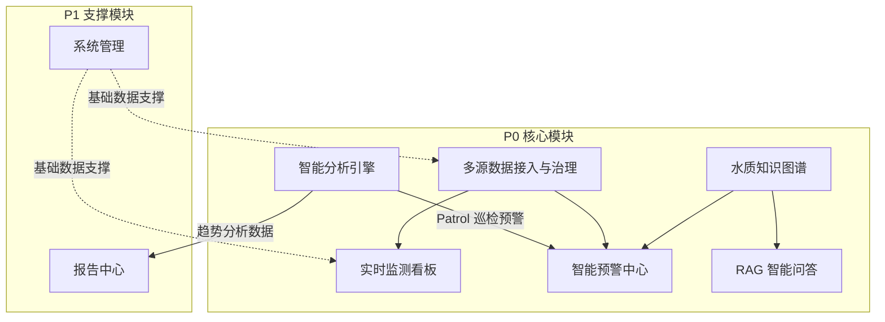
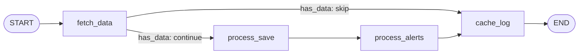
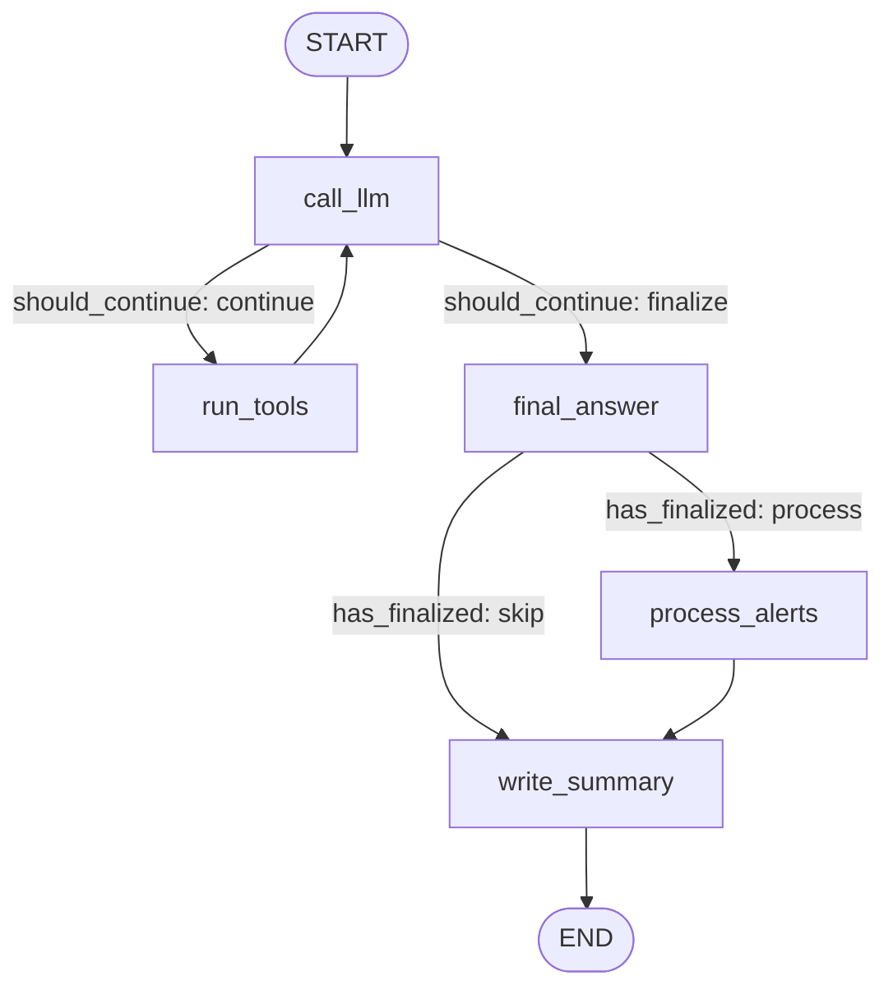

# 水库水质智慧监测平台 · 前端驱动功能模块与接口设计

## 1. 模块总览

### 1.1 系统模块架构

平台由 8 个业务模块构成，按优先级分为 P0 核心模块和 P1 支撑模块。各模块职责清晰、依赖明确：



| 模块 | 优先级 | 职责定位 | 技术依赖 |
|------|--------|---------|---------|
| M1 多源数据接入与治理 | P0 | 数据底座：监测记录存储、查询、校验 | MySQL、Redis |
| M2 实时监测看板 | P0 | 数据展示层：首页总览、水库卡片 | 依赖 M1 |
| M3 智能预警中心 | P0 | 预警生命周期：检测→确认→处置→归档 | 依赖 M1、M5、M6 |
| M4 RAG 智能问答 | P0 | 知识问答：标准/案例/预案的自然语言检索 | Chroma、LLM |
| M5 水质知识图谱 | P0 | 关系推理：溯源、指标关联、管网拓扑 | Neo4j |
| M6 智能分析引擎 | P0 | 系统大脑：由 Pipeline（确定性采集）+ Agent（ReAct 趋势分析）+ 工具函数（处置建议）三层构成。Collector 采集管道（定时采集+规则判定）、Analyst ReAct Agent（StateGraph + ToolNode 自循环）、Report Generator Pipeline（报告生成）、llm_suggestion（处置建议生成） | LangGraph、LLM |
| M7 报告中心 | P1 | 报告生产：日巡检/季度/事件报告自动生成与审核 | 依赖 M6 |
| M8 系统管理 | P1 | 基础配置：用户/角色/权限/水库/站点/指标 | MySQL |

### 1.2 前端页面与模块映射

| 编号 | 页面 | 目标用户 | 对应模块 | 接口覆盖 |
|------|------|---------|---------|---------|
| 07a | 登录页 | 全部用户 | M8 | 已覆盖 |
| 07b | 首页告警总览 | 全部用户 | M2、M3 | 已覆盖 |
| 07c | 水库实时监测详情 | 监测员、技术员 | M1、M2 | 已覆盖 |
| 07d | 预警中心 | 监测员、技术员、负责人 | M3 | 已覆盖 |
| 07e | 预警详情与溯源 | 技术员、分析师、负责人 | M3、M5、M6 | 已覆盖（溯源图谱+污染源列表+历史相似事件）**新增：AI 建议自动生成状态 + 确认处置方案按钮** |
| 07f | 智能问答 | 全部用户 | M4 | ✅ 已实现（SSE 流式 + RAG 知识库 + MySQL 结构化数据查询 + 对话历史管理 + 重试/修改） |
| 07g | 知识图谱可视化 | 分析师、负责人 | M5 | ✅ 已实现（力导向图谱 + 节点搜索 + 水库筛选 + 节点详情 + 节点展开 + 污染溯源 + 聚焦模式） |
| 07h | 巡检报告列表与详情 | 全部用户 | M7 | ✅ 已实现（报告卡片网格、详情预览、审核操作、生成报告、导出） |
| 07i | 水库站点配置管理 | 管理员 | M8 | 已覆盖（含图谱实体管理Tab，Neo4j直写） |
| 07j | 知识库管理 | 管理员、负责人 | M4、M8 | 部分覆盖（上传+列表+详情+删除+重新处理） |
| 07k | 用户与权限管理 | 管理员 | M8 | 已覆盖 |
| 07m | 预警规则管理 | 管理员 | M8 | 已覆盖 |

---

## 2. 系统管理模块（M8）

### 功能描述

M8 提供平台基础能力支撑，是其他所有模块的数据上游。包含用户认证与登录、用户与角色的权限管理、水库/监测站点/监测指标的基础数据配置（写入 MySQL 后自动同步至 Neo4j），以及 Neo4j 图谱实体（水库/站点/指标/河流/污染源）的直写管理。所有 CRUD 接口要求 admin 角色，认证接口无角色要求。

当前 M8 是接口覆盖最完整的模块，登陆、用户、角色、水库、站点、指标、预警规则七组接口均已实现。后续可补充导入导出、权限树模板等辅助能力。

### 涉及页面

- **登录页（07a）** —— 登录/注册/退出/当前用户
- **用户与权限管理（07k）** —— 用户 CRUD、角色 CRUD
- **水库站点配置管理（07i）** —— 水库/站点/指标 CRUD + 图谱实体管理 Tab
- **预警规则管理（07m）** —— 规则 CRUD、启用/禁用

### 接口设计

#### 2.1 认证登录

| 功能 | 方法 | 路径 | 请求参数 | 响应 | 状态 |
|------|------|------|---------|------|------|
| 登录 | POST | /api/auth/login | username, password, phone?(11位), dingtalk_id? | access_token + username | ✅ |
| 注册 | POST | /api/auth/register | username, password, phone?(11位) | user_id + username | ✅ |
| 退出登录 | POST | /api/auth/logout | — | message | ✅ |
| 当前用户 | GET | /api/auth/me | — | user_id, username, role, phone?, dingtalk_id? | ✅ |

#### 2.2 用户管理

| 功能 | 方法 | 路径 | 请求参数 | 响应 | 状态 |
|------|------|------|---------|------|------|
| 用户列表 | GET | /api/users/list | keyword?, role_id?, status?, page, page_size | 分页用户列表 | ✅ |
| 添加用户 | POST | /api/users/add | username, password?(默认"123456"), real_name?, phone?, role_id, dingtalk_id? | id + username | ✅ |
| 用户详情 | GET | /api/users/{id} | — | 用户全部字段 | ✅ |
| 更新用户 | PUT | /api/users/{id} | real_name?, phone?, role_id?, dingtalk_id?, status? | 更新后用户信息 | ✅ |
| 重置密码 | POST | /api/users/{id}/reset-password | password | true | ✅ |

#### 2.3 角色管理

| 功能 | 方法 | 路径 | 请求参数 | 响应 | 状态 |
|------|------|------|---------|------|------|
| 角色列表 | GET | /api/roles/list | page?, page_size? | 分页角色列表 | ✅ |
| 添加角色 | POST | /api/roles/add | name, code, permissions? | 角色详情含 permissions | ✅ |
| 角色详情 | GET | /api/roles/{id} | — | 角色全部字段含 permissions | ✅ |
| 更新角色 | PUT | /api/roles/update | id, name?, code?, permissions? | true | ✅ |
| 删除角色 | DELETE | /api/roles/{id} | — | true | ✅ |

#### 2.4 水库管理

| 功能 | 方法 | 路径 | 请求参数 | 响应 | 状态 |
|------|------|------|---------|------|------|
| 水库列表 | GET | /api/reservoir/list | keyword?, watershed?, water_grade?, status?, page, page_size | 分页水库列表 | ✅ |
| 创建水库 | POST | /api/reservoir/create | name, code, location?, longitude?, latitude?, capacity?, water_grade?, watershed?, sort_order?(默认0) | true | ✅ |
| 水库详情 | GET | /api/reservoir/{id} | — | 水库全部字段含 status | ✅ |
| 更新水库 | PUT | /api/reservoir/{id} | name?, code?, location?, longitude?, latitude?, capacity?, water_grade?, watershed?, status?, sort_order? | true | ✅ |
| 删除水库 | DELETE | /api/reservoir/{id} | — | true | ✅ |

#### 2.5 监测站点管理

| 功能 | 方法 | 路径 | 请求参数 | 响应 | 状态 |
|------|------|------|---------|------|------|
| 创建站点 | POST | /api/stations/create | reservoir_id, name, code, type?(auto/manual/sensing), longitude?, latitude?, sampling_point? | true | ✅ |
| 站点列表 | GET | /api/stations/list | reservoir_id?, keyword?, code?, type?, page, page_size | 分页站点列表含 last_data_time | ✅ |
| 站点详情 | GET | /api/stations/{id} | — | 站点全部字段含 status | ✅ |
| 更新站点 | PUT | /api/stations/{id} | reservoir_id?, name?, code?, type?, longitude?, latitude?, sampling_point?, status? | true | ✅ |
| 删除站点 | DELETE | /api/stations/{id} | — | true | ✅ |

#### 2.6 指标管理

| 功能 | 方法 | 路径 | 请求参数 | 响应 | 状态 |
|------|------|------|---------|------|------|
| 创建指标 | POST | /api/indicators/create | name, code, unit?, category?(物理/化学/生物/综合), standard_limit_i~v_lower?, standard_limit_i~v_upper?, is_core?(0/1) | true | ✅ |
| 指标列表 | POST | /api/indicators/list | name?, code?, category?, is_core?, page, page_size | 分页指标列表含标准限值 | ✅ |
| 指标详情 | GET | /api/indicators/{id} | — | 指标全部字段 | ✅ |
| 更新指标 | PUT | /api/indicators/{id} | name?, code?, unit?, category?, standard_limit_i~v_lower?, standard_limit_i~v_upper?, is_core? | true | ✅ |
| 删除指标 | DELETE | /api/indicators/{id} | — | true | ✅ |

---


#### 2.7 预警规则管理

| 功能 | 方法 | 路径 | 请求参数 | 响应 | 状态 |
|------|------|------|---------|------|------|
| 规则列表 | POST | /api/v1/alert-rules/list | indicator_id?, reservoir_id?, is_active?, page, page_size | 分页规则列表(含 rule_name, indicator_id, compare_direction, trigger_class, alert_level, is_active, remark) | ✅ |
| 规则详情 | GET | /api/v1/alert-rules/{id} | — | 规则全部字段含 remark/created_at/updated_at | ✅ |
| 创建规则 | POST | /api/v1/alert-rules/create | rule_name, indicator_id, reservoir_id?, compare_direction(gt/lt), trigger_class(I~V), alert_level(1~3), is_active?, remark? | true | ✅ |
| 更新规则 | PUT | /api/v1/alert-rules/{id} | rule_name?, indicator_id?, reservoir_id?, compare_direction?, trigger_class?, alert_level?, is_active?, remark? | true | ✅ |
| 删除规则 | DELETE | /api/v1/alert-rules/{id} | — | true | ✅ |

## 3. 多源数据接入与治理模块（M1）

### 功能描述

M1 是系统的数据底座，负责各类水质监测数据的接入、清洗校验与关系型存储。核心数据实体为监测记录（monitoring_record），关联水库、站点、指标三个维度。

当前 M1 已实现监测记录的**查询**能力——支持按水库/站点/指标/时间范围/数据质量多维度筛选的分页列表、全指标最新值聚合查询、以及单指标时序趋势查询。数据**写入**层面，监测记录由外部自动化采集程序或定时任务入库，当前未提供人工录入 REST 接口，后续可补充人工采样录入和 Excel 批量导入接口。

本次新增 **Redis 24h 缓存**：定时采集入库后同步写入 Redis（ZSET 趋势数据 + String 最新值），24h 内趋势查询和最新值查询优先走 Redis，响应速度提升 10~50 倍。Redis 不可用时自动降级 MySQL，对前端透明。

### 涉及页面

- **水库实时监测详情（07c）** —— 实时数据 Tab 使用水库全指标最新值接口，历史趋势 Tab 使用趋势查询接口，监测站点 Tab 使用站点列表接口

### 接口设计

| 功能 | 方法 | 路径 | 请求参数 | 响应 | 状态 |
|------|------|------|---------|------|------|
| 监测记录列表 | GET | /api/monitoring/records | page, page_size, reservoir_id?, station_id?, indicator_id?, start_time?, end_time?, quality_flag?(0/1/2) | 分页记录列表(含 id, reservoir_id, station_id, indicator_id, value, record_time) | ✅ |
| 水库全指标最新值 | GET | /api/monitoring/last | reservoir_id | records[](各指标最新值含 indicator_id, indicator_name, value, quality_flag, record_time) | ✅ |
| 监测趋势 | GET | /api/monitoring/trend | reservoir_id, indicator_id, start_time?, end_time? | lists[](时序数据含 reservoir_id, indicator_id, record_time, value) + total | ✅ |
| 人工采样录入 | POST | /api/monitoring/manual-input | station_id, indicator_id, value, record_time, quality_flag?(0/1/2) | 创建的监测记录(含 id, reservoir_id, station_id, indicator_id, value, record_time) | ✅ |
| Excel 批量导入 | POST | — | file(CSV/Excel), reservoir_id | — | ❌ 待补 |

---

## 4. 实时监测看板模块（M2）

### 功能描述

M2 是系统的数据展示层，直接面向监测员和管理层提供"第一眼"全局水质概览。包含四个统计卡片、水库卡片网格列表以及各水库核心指标最新监测值。数据源自 M1 的聚合查询，当前通过独立的仪表盘接口提供封装好的统计和卡片数据。

M2 当前已实现首页总览统计、水库卡片列表和最近告警三个核心接口，数据格式与前端页面需求基本匹配，但部分字段语义存在微调空间（如 `normal_count` 实际为在线站点数而非正常水库数，`alert_count` 为全部告警总数而非今日告警数）。

### 涉及页面

- **首页告警总览（07b）** —— 统计卡片使用 overview 接口，水库卡片网格使用 reservoir-cards 接口，最新告警时间线使用 last-alert 接口

### 接口设计

| 功能 | 方法 | 路径 | 请求参数 | 响应 | 状态 |
|------|------|------|---------|------|------|
| 仪表盘总览 | GET | /api/v1/dashboard/overview | — | reservoir_count, normal_count, abnormal_count, record_alert_count, rule_alert_count, ai_alert_count, offline_stations | ✅ **字段已更正** |
| 水库卡片列表 | GET | /api/v1/dashboard/reservoir-cards | — | 水库数组(各含 id, name, code, location?, water_grade?, watershed?, station_count, online_station_count, alert_count, indicators[]) | ✅ |
| 最近告警 | GET | /api/v1/dashboard/last-alert | — | 最近 5 条告警数组，含 alert_id, reservoir_id, title, alert_level, indicators, source, status, detected_at | ✅ **新增 source** |

---

## 5. 智能预警中心模块（M3）

### 功能描述

M3 负责预警事件从发现到闭环的完整生命周期管理。当前已实现预警的**基础查询与状态流转**——支持按水库/等级/状态/时间范围筛选的分页列表、单条详情查看、以及状态更新（确认→处置→解决，同时记录处理人）。

预警内容的深度分析能力（溯源推理、AI 处置建议步骤化、历史相似事件匹配）依赖 M5 图谱和 M6 Agent 提供数据，当前已支持结构化溯源图谱（Neo4j）和 AI 处置建议（RAG+LLM）。

本次新增 **自动预警检测**：定时采集数据入库后自动匹配 `alert_rule` 表规则，按比较方向+触发等级判定是否超标。同指标同水库已存在未关闭预警则跳过，不同指标合并为复合告警（取最高等级、更新标题为"多指标复合告警"）。默认预置 10 条全局规则覆盖 COD/氨氮/溶解氧/浊度/pH 五个核心指标。

本次新增 **WebSocket 实时预警推送**：自动预警创建后通过 `/ws/alerts` 实时推送到所有在线浏览器，前台以 `ElNotification` 弹窗展示，点击跳转预警详情。断线后 5 秒自动重连。

本次新增 **AI 处置建议自动触发**：Collector Agent 创建预警后异步触发 `llm_suggestion(alert_id)`，在后台完成污染溯源、RAG 检索、LLM 生成处置建议，结果写入预警 `suggestion` 字段和 `suggestion_status`（无/生成中/已生成/已确认）。用户打开详情页时建议已就绪，无需等待。

### 涉及页面

- **预警中心（07d）** —— 预警列表分页、多条件筛选
- **预警详情与溯源（07e）** —— 预警基础信息、超标指标、状态流转、溯源与建议。**新增：suggestion_status 状态指示 + 确认处置方案按钮 + 重新生成按钮**

### 接口设计

| 功能 | 方法 | 路径 | 请求参数 | 响应 | 状态 |
|------|------|------|---------|------|------|
| 预警列表 | GET | /api/v1/alerts | page, page_size, reservoir_id?, alert_level?(1/2/3), status?(0~3), source?(0=规则判定/1=AI趋势分析), start_time?, end_time? | 分页预警列表(含 handler_name, title, alert_level(1/2/3), indicators, source, status, detected_at, resolved_at) | ✅ **新增 source 筛选+响应字段** |
| 预警详情 | GET | /api/v1/alerts/{id} | — | 预警详情(含 id, reservoir_id, handler_id, title, alert_level, indicators, source, source_desc?, suggestion?(list|null), suggestion_status(无/生成中/已生成/已确认), notes[], status, detected_at, resolved_at) | ✅ **新增 source、suggestion 可 null** |
| 更新预警状态 | PUT | /api/v1/alerts/{id} | status(0~3), handler_id? | 更新后预警详情 | ✅ |
| 处置备注 | POST | /api/v1/alerts/{id}/notes | content | 备注详情(含 id, user_id, content, created_at) | ✅ |
| 未读预警数 | GET | /api/v1/alerts/unread-count | — | count | ✅ |
| 批量标记已读 | PUT | /api/v1/alerts/batch-read | ids, handler_id? | true | ✅ |
| 预警溯源 | GET | /api/v1/alerts/{id}/trace | 路径参数：id（预警ID） | nodes[](图谱节点) + edges[](图谱边) + sources[](污染源列表) | ✅ |
| AI 处置建议 | POST | /api/v1/alerts/{id}/suggestion | 路径参数：id（预警ID） | lists[](步骤化建议含 step/title/description) | ✅ **保留手动入口** |
| AI 建议确认 | PUT | /api/v1/alerts/{id}/suggestion/confirm | — | 更新 suggestion_status 为"已确认" | ✅ |
| 历史相似事件 | GET | /api/v1/alerts/{id}/similar | 路径参数：id（预警ID）+ 分页参数 | 分页事件列表(含 matched_indicators) | ✅ |
| 新预警实时推送 | WS | /ws/alerts | — | 预警事件 JSON（new_alert 新预警 / alert_updated 合并预警，含 type/id/title/alert_level/status） | ✅ |

---

## 6. RAG 智能问答模块（M4）

### 功能描述

M4 提供基于 RAG（检索增强生成）的智能问答能力，让用户通过自然语言直接查询水质标准、处置预案和历史案例。核心流程：知识库文档上传 → 文本切片 → Embedding 向量化 → Chroma 存储 → 用户提问 → 语义检索 → LLM 生成带出处回答。

当前 M4 已完成从三阶段 Pipeline 到 ReAct Agent 的重构升级。核心流程：用户提问 → Agent（StateGraph + ToolNode）自主决定检索路径 → 按需调用 search_knowledge_base / query_monitoring_data / query_knowledge_graph / check_water_standard 四个工具 → 信息聚合 → LLM 流式生成带出处回答。Agent 可动态规划多步检索（如先查标准→再查数据→最后查案例），无需固定 Pipeline。同时保留知识库文档上传、列表、详情、删除和重新处理接口。

### 涉及页面

- **知识库管理（07j）** —— 文档上传、文档列表、文档详情、文档删除、文档重新处理 —— ✅ 已实现
- **智能问答（07f）** —— 对话式问答、流式输出、思考过程展示、参考来源展示 —— ✅ 已实现

### 接口设计

#### 6.1 知识库文档管理（本阶段实现）

| 功能 | 方法 | 路径 | 请求参数 | 响应 | 状态 |
|------|------|------|---------|------|------|
| 上传文档 | POST | /api/v1/documents/upload | files(multipart), category(int) | UploadDocumentResponse(total, success_count, failed_count, lists[]) | ✅ 已实现 |
| 文档列表 | GET | /api/v1/documents | keyword?, doc_type?, status?, page, page_size | 分页文档列表(含 id, title, file_name, file_size, doc_type, status, chunk_count, created_at) | ✅ 已实现 |
| 文档详情 | GET | /api/v1/documents/{id} | — | 文档全部字段(含 id, title, file_name, file_size, doc_type, status, chunk_count, content, metadata, created_at, updated_at) | ✅ 已实现 |
| 删除文档 | DELETE | /api/v1/documents/{id} | — | true | ✅ 已实现 |
| 重新处理文档 | POST | /api/v1/documents/{id}/reprocess | — | true | ✅ 已实现 |

#### 6.2 智能问答对话（当前阶段实现）

| 功能 | 方法 | 路径 | 请求参数 | 响应 | 状态 |
|------|------|------|---------|------|------|
| 智能问答(流式) | POST | /api/v1/chat | query, session_id? | SSE 流式 chunk + done + progress（ReAct Agent 工具调用阶段动态展示） | ✅ 已实现 |
| 对话历史列表 | GET | /api/v1/chat | page, page_size | 分页对话列表 | ✅ 已实现 |
| 对话详情 | GET | /api/v1/chat/{id} | 路径参数 id | 对话详情含消息列表 | ✅ 已实现 |
| 删除对话 | DELETE | /api/v1/chat/{id} | 路径参数 id | true | ✅ 已实现 |
| 重试/修改对话 | POST | /api/v1/chat/update | session_id, message_id, query | 重试后 SSE 流式 | ✅ 已实现 |

---

## 7. 水质知识图谱模块（M5）

### 功能描述

M5 基于 Neo4j 图数据库构建水库-河流-污染源之间的实体关系网络，用于污染溯源推理和指标关联分析。与传统关系型数据库不同，图数据库能自然表达"从超标点出发，沿水系向上游追溯 3 公里内的潜在污染源"这类多跳推理逻辑。

当前 M5 已完成图谱全局概览接口与可视化页面开发，其余查询接口（搜索/详情/扩展/溯源）待补。前端使用 ECharts graph 力导向布局，后端基于 Neo4j Cypher 查询提供数据。

### 涉及页面

- **知识图谱可视化（07g）** —— 力导向图展示、搜索、详情面板、溯源路径
- **预警详情与溯源（07e）** —— 从预警详情跳转图谱的溯源模式

### 接口设计

| 功能 | 方法 | 路径 | 请求参数 | 响应 | 状态 |
|------|------|------|---------|------|------|
| 图谱全局概览 | GET | /api/v1/graph/overview | reservoir_code? | nodes[] + edges[] | ✅ 已实现 |
| 节点搜索 | GET | /api/v1/graph/search | keyword, type? | 匹配节点列表 | ✅ 已实现 |
| 节点详情 | GET | /api/v1/graph/node/{type}/{id} | — | 节点完整属性 | ✅ 已实现 |
| 节点一跳扩展 | GET | /api/v1/graph/expand/{type}/{id} | depth? | 该节点相邻子图 | ✅ 已实现 |
| 污染溯源路径 | GET | /api/v1/graph/trace | reservoir_code, indicator_code? | 溯源路径 nodes + edges | ✅ 已实现 |

---

## 8. 智能分析引擎模块（M6）

### 功能描述

M6 是系统的"大脑"，基于 LangGraph StateGraph 编排 Pipeline、Agent 和工具函数，将数据采集、异常检测、趋势分析、报告生成自动化。各组件不独立暴露为前端页面，而是通过业务模块（M3 预警中心、M7 报告中心）消费其产出。

核心设计原则：

- **Pipeline = 确定性工作流**：无 LLM 决策，固定 DAG，适合 ETL/规则引擎等已知流程
- **Agent = LLM 驱动决策**：LLM 决定下一步动作，支持自循环 + 工具调用，适合需要推理的复杂任务
- **工具函数 = 单步操作**：不成工作流，作为独立函数被 Pipeline 或 Agent 调用
- **数据驱动协作**：组件之间不直接调用，通过共享数据库表隐式协作
- **事务优先**：数据库事务提交成功后，才能执行 Redis 缓存、WebSocket 广播、建议任务投递
- **失败隔离**：LLM、Neo4j、RAG 失败不影响 Collector 的 10 分钟采集任务
- **巡检日志持久化**：Collector 每次执行结果写入 MySQL 巡检日志表，可追溯可查询

### 组件定义

| 组件 | 分类 | 触发方式 | 是否调 LLM | 核心闭环 |
|------|------|---------|:---------:|---------|
| **Collector 采集管道** | Pipeline | APScheduler 每 10 分钟 | 否 | 采集 API 数据 → 入库 → 规则判定 → 创建/合并预警 → WebSocket 推送 → 记录巡检日志 |
| **Analyst Agent** | Agent（ReAct Agent，StateGraph + ToolNode） | APScheduler 每 6 小时 | **是** | 双阶段输出：工具探索（call_llm → run_tools 循环）→ 最终输出（final_answer → process_alerts → write_summary） |
| **Report Generator** | Pipeline（LLM 增强工作流） | APScheduler 每天早 8 时 / REST API 手动触发 | **是** | 聚合巡检日志/趋势分析/预警数据 → LLM 生成报告 → 写入 report 表（草稿状态） |
| **`llm_suggestion()`** | 工具函数 | 预警创建后异步触发 | **是** | Neo4j 溯源 → RAG 检索 → LLM 生成处置步骤 → 写入预警 suggestion 字段 |

### 组件协作关系

```
Collector Pipeline(每10分钟)
  ├─ 正常结束 → 写入巡检日志
  └─ 检测超标 → 创建规则预警(source=0) → 异步触发 llm_suggestion(alert_id)
                                                └─ 生成建议 → 写入 suggestion 字段
                                                              → 用户打开详情已可见

Analyst ReAct Agent(每6小时，StateGraph + ToolNode 自循环)
  ├─ 工具探索阶段（call_llm → run_tools 循环）
  │   ├─ query_reservoir_overview_tool → 获取水库概览
  │   ├─ query_monitoring_records_tool → 获取趋势特征
  │   ├─ neo4j_trace_pollution_tool → 污染溯源（按需）
  │   └─ rag_retrieve_context_tool → 知识库检索（按需）
  ├─ 最终输出阶段（final_answer → JsonOutputParser 兜底）
  ├─ 正常结束 → 写入 patrol_analysis
  └─ 发现趋势异常 → 创建 AI 预警(source=1) → 异步触发 llm_suggestion(alert_id)
                                                  └─ 生成建议 → 写入 suggestion 字段

Report Generator Pipeline(每天早8时)
  ├─ 聚合 patrol_log/patrol_analysis/alert_event/monitoring_record 数据
  ├─ LLM 生成结构化报告（摘要+章节+结论）
  └─ 写入 report 表（status = draft，供前端预览审核）

用户手动操作:
  ├─ 预警详情 → 点击"生成建议" → 重新触发 llm_suggestion(alert_id)(覆盖旧结果)
  └─ 报告中心 → 手动触发报告生成（POST /api/v1/reports/generate）
```

---

### Collector 采集管道详细设计

文件：`pipelines/collector.py`

#### LangGraph 图结构拓扑

Collector 为确定性 DAG，无 LLM 决策，4 节点串联：



| 元素 | 类型 | 说明 |
|------|------|------|
| `fetch_data` | 节点 | 采集数据：模拟模式或真实模式，失败时跳过后续直达 `cache_log` |
| `process_save` | 节点 | 处理入库：按 station_code 匹配站点，遍历字段名匹配指标编码 |
| `process_alerts` | 节点 | 规则预警引擎：批量指标+规则+未关闭预警 → 内存判定 → 创建/合并规则预警（source=0）→ commit → WS 广播 → Redis 缓存 → 异步 `llm_suggestion` |
| `cache_log` | 节点 | 缓存与日志：写入 Redis 趋势缓存 + 插入 `patrol_log` |
| `has_data` | 条件边 | 有数据 → `"continue"`；无数据 → `"skip"` 直通 `cache_log` |

#### APScheduler 调用方式

APScheduler 每 10 分钟调用 `run_collector_agent()` 入口函数。Pipeline 没有人工审批环节，执行状态记录到 patrol_log 表。

---

### Analyst ReAct Agent 详细设计

文件：`agent/analyst.py` + `agent/analyst_tools.py`

#### 工作流节点（当前版本：ReAct Agent — StateGraph + ToolNode）

```
双阶段输出：
  ┌─────────────────────────────────────────────────────────┐
  │  阶段一：工具探索循环                                    │
  │  call_llm（LLM 决策）→ should_continue（有 tool_calls） │
  │    → run_tools（ToolNode 分发）→ call_llm（下一轮）     │
  │    重复直到 LLM 输出不含 tool_calls                      │
  │                                                         │
  │  可用工具：                                              │
  │  - query_reservoir_overview_tool → 水库概览             │
  │  - query_monitoring_records_tool → 趋势特征（自动缓存） │
  │  - neo4j_trace_pollution_tool → 污染溯源（按需）        │
  │  - rag_retrieve_context_tool → 知识库检索（按需）       │
  ├─────────────────────────────────────────────────────────┤
  │  阶段二：最终输出                                        │
  │  final_answer（纯模型 + JsonOutputParser 兜底 JSON）     │
  │  → has_finalized（成功→process_alerts，失败→write_sum）│
│  → process_alerts（创建 AI 预警 + 异步触发生成处置建议） │
│  → write_summary（写入 patrol_analysis + 有痕失败记录） │
  └─────────────────────────────────────────────────────────┘
```

#### LangGraph 图结构拓扑

通过 `build_react_graph()` 编译的 StateGraph 结构如下：



| 元素 | 类型 | 函数 | 说明 |
|------|------|------|------|
| `call_llm` | 节点 | `call_llm(state)` | LLM 决策：`bind_tools(TOOLS)` 不设 `tool_choice`，LLM 自由选择是否调用工具 |
| `run_tools` | ToolNode | `ToolNode(TOOLS)` | 内置节点，根据 `AIMessage.tool_calls` 分发执行对应 `@tool` 函数 |
| `final_answer` | 节点 | `final_answer(state)` | 纯聊天模型 + `JsonOutputParser` 强制输出 JSON，内部 `except OutputParserException` |
| `process_alerts` | 节点 | `process_alerts(state)` | 复用原逻辑：水库级去重 → 创建 `AlertEvent(source=1)` → broadcast/cache → `llm_suggestion` |
| `write_summary` | 节点 | `write_summary(state)` | 正常写入 patrol_analysis；`status=FAILED` 时写 `reservoir_id=None` 失败记录 |
| `should_continue` | 条件边 | `should_continue(state) → str` | 有 `tool_calls` → `"continue"`；无 → `"finalize"` |
| `has_finalized` | 条件边 | `has_finalized(state) → str` | `analysis_result` 有值 → `"process"`；空 → `"skip"` |

#### 状态定义

```python
class ReActAnalystState(MessagesState):
    status: AnalystStatus | None          # 执行状态
    period_start: str | None              # 分析时段开始
    period_end: str | None                # 分析时段结束
    reservoirs_data: list | None          # 水库概览数据（缓存）
    features: list | None                 # 趋势特征（缓存）
    analysis_result: dict | None          # LLM 最终结构化输出
    supplementary_alert_ids: dict | None  # 创建的 AI 预警 ID 映射
    analysis_ids: list | None             # 写入的 patrol_analysis ID 列表
    error: str | None                     # 错误信息
    start_time: str | None                # 任务开始时间
    duration_ms: int | None               # 任务耗时（ms）
```

继承 `MessagesState` 自带 `messages: list[BaseMessage]` 驱动 ReAct 循环。

#### 入口函数

```python
async def run_analyst_agent():
    graph = build_react_graph()
    try:
        result = await asyncio.wait_for(
            graph.ainvoke(initial_state, {"recursion_limit": 120}),
            timeout=600,
        )
    except GraphRecursionError:
        await _write_failure_record(now, "[分析超限]")
    except asyncio.TimeoutError:
        await _write_failure_record(now, "[执行超时]")
    except Exception as e:
        await _write_failure_record(now, f"[分析异常] {e}")
```

入口函数无参（`APScheduler` 兼容），使用 `asyncio.wait_for` 10 分钟硬超时，所有异常路径均写入 `patrol_analysis` 持久化记录。

#### 关键设计决策

| 决策 | 说明 |
|------|------|
| **双阶段输出** | 工具探索阶段不设 `tool_choice`，LLM 自由选择工具；最终输出阶段用纯聊天模型 + `JsonOutputParser` 强制输出合规 JSON |
| **缓存层** | `query_monitoring_records_tool` 内嵌 `@alru_cache(cache_exceptions=False)`，同一水库的重复查询直接命中缓存 |
| **有痕失败** | 入口函数捕获 `GraphRecursionError` / `TimeoutError` / `Exception`，均写入 `PatrolAnalysis(reservoir_id=None, summary="[分析失败]...")` 持久化记录 |
| **消息截断** | `call_llm` 节点保留 System + 最近 10 条消息，防止上下文窗口超限 |
| **recursion_limit** | 设置为 120，配合 `asyncio.wait_for(timeout=600)` 双重保护 |

#### 工具函数签名

| 工具 | 参数 | 说明 |
|------|------|------|
| `query_reservoir_overview_tool` | `reservoir_ids: list[int] \| None` | 查询水库列表 |
| `query_monitoring_records_tool` | `reservoir_id: int, indicator_ids: list[int]\|None, hours: int` | 查询趋势特征，自动 `@alru_cache` |
| `neo4j_trace_pollution_tool` | `reservoir_code: str` | Neo4j 污染溯源 |
| `rag_retrieve_context_tool` | `query: str, top_k: int` | Chroma + BM25 双路 RAG 检索 |

---

### `llm_suggestion()` 工具函数

文件：`services/alerts.py`

自建 DB/Neo4j session，不自成工作流。幂等保护：`suggestion_status == 1` 时跳过。异常时恢复状态为 0。

调用方：Collector Pipeline（创建规则预警后）、Analyst Agent（创建 AI 预警后）、用户手动（`POST /api/v1/alerts/{id}/suggestion`）。

---

### 8.7 Agent 重构计划

| 阶段 | 目标 | 模式 | 状态 |
|------|------|------|:----:|
| 一 | Analyst → ReAct Agent | StateGraph + ToolNode + 双阶段输出（工具探索→最终输出），4 个 `_tool` 函数，`async-lru` 缓存 | ✅ **已完成** |
| 二 | M4 智能问答 → ReAct Agent | 用户提问后自主规划检索路径（MySQL/Neo4j/RAG 按需组合） | ✅ **已完成** |
| 三 | 新增严重预警自动调查 Agent | 3 级预警触发后自动溯源、查数据、出调查报告 | 后续规划 |

---

### 涉及页面

- **预警详情与溯源（07e）** —— Collector Pipeline 产出规则预警和溯源数据，`llm_suggestion()` 产出处置建议（suggestion_status 状态显示 + 确认/重新生成交互）
- **巡检报告列表与详情（07h）** —— Report Generator Pipeline 产出报告，M7 模块实现审核与展示

### 接口设计

#### 巡检日志查询（已实现）

| 功能 | 方法 | 路径 | 请求参数 | 响应 | 状态 |
|------|------|------|---------|------|------|
| 巡检日志列表 | POST | /api/v1/patrol-logs/list | status?, start_time?, end_time?, page, page_size | 分页巡检日志(含 executed_at, station_count, record_count, new_alert_count, duration_ms, status, error) | ✅ **已实现** |
| 删除巡检日志 | DELETE | /api/v1/patrol-logs/{id} | 路径参数 id | true | ✅ **已实现** |

---

## 9. 报告中心模块（M7）

### 功能描述

M7 负责各类水质报告的自动生成与管理，包括日巡检报告、季度水质报告和事件应急报告。报告内容由 Report Generator Pipeline 聚合巡检日志、趋势分析和预警数据进行生成，技术负责人审核确认后归档发布。

**手动触发**：用户可按需选择时间范围和报告类型，生成自定义报告。

所有报告生成通过异步任务执行，生成后以草稿状态展示，用户可预览、审核发布或要求重新生成。

### 涉及页面

- **巡检报告列表与详情（07h）** —— 报告卡片网格、详情预览、审核操作（新增页面）

### 接口设计

| 功能 | 方法 | 路径 | 请求参数 | 响应 | 状态 |
|------|------|------|---------|------|------|
| 报告列表 | POST | /api/v1/reports/list | page, page_size, report_type?(daily/quarterly/event), status?(draft/published/no_data), keyword? | 分页报告列表(含 id, title, report_type, status, summary, created_at, published_at) | ✅ **已实现** |
| 报告详情 | POST | /api/v1/reports/{id} | 路径参数 id | 报告完整内容(含 title, sections[], summary, conclusion, period_start, period_end) | ✅ **已实现** |
| 生成报告 | POST | /api/v1/reports/generate | type, reservoir_ids?, alert_id?（异步执行，立即返回） | report_id + status(generating) | ✅ **已实现** |
| 审核报告 | POST | /api/v1/reports/{id}/review | action(approve/reject), comment? | true | ✅ **已实现** |
| 导出报告 | POST | /api/v1/reports/{id}/export | format?(markdown) | 文本内容（markdown） | ✅ **已实现** |
